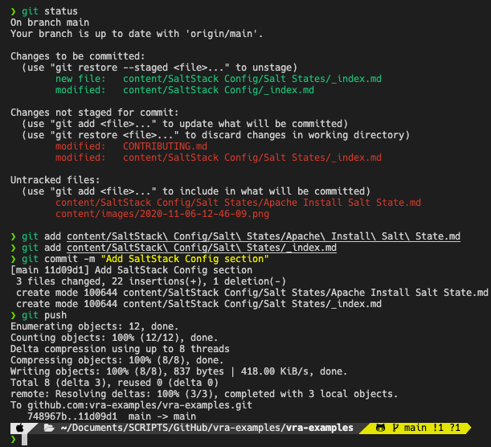

# How to contribute

## Installing Hugo

Install Hugo on your local machine - https://gohugo.io/getting-started/installing/

I'm using a Mac - 
```bash
brew install hugo
```

## Clone the source repository

```
git clone https://github.com/vra-examples/vra-examples.git
```

In the `vra-examples/content` the folder structure represents the page structure:


To add a new parent topic:
1. Create the parent folder - e.g. `SaltStack Config`
2. Create the `_index.md`
    ```yaml
    ---
    title: "SaltStack Config"
    date: 2020/11/04 14:21
    anchor: "saltstackconfig"
    weight: 400
    ---
    SaltStack Config Examples - a short description or introduction to the section.
    ```
3. Create subfolder to create a content type - e.g. `Salt States`
4. Create the `_index.md` content section header
    ```yaml
    ---
    title: "Salt States"
    date: 2020/11/04 14:21
    anchor: "saltstates"
    weight: 410
    ---
    Salt States
    ```
5. Create a content file - e.g. `Apache Install Salt State.md`
    ```yaml
    ---
    title: "Apache Install Salt State"
    date: 2020/11/04 14:21
    anchor: "apacheinstallsaltstate"
    ---
    This Salt State can be used to install Apache and ensure that the service is running:

        ```yaml
        apache:
        pkg.installed: []
        service.running:
            - require:
            - pkg: apache
        ```
    ```
6. Add the untracked files to git
    ```bash
    git status # View untracked or modified files
    git add content/SaltStack\ Config/Salt\ States/Apache\ Install\ Salt\ State.md # Add the files
    git add content/SaltStack\ Config/Salt\ States/_index.md
    git commit -m "Add SaltStack Config section" # Create a meaningful commit message
    git push # Push the commit
    ```
    
7. Once the PR is approved, GitHub actions will automatically build and publish the content