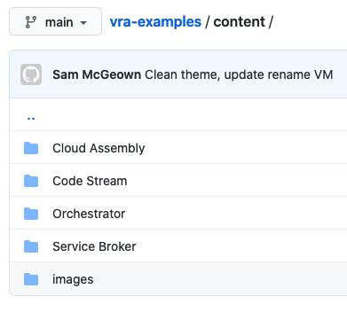
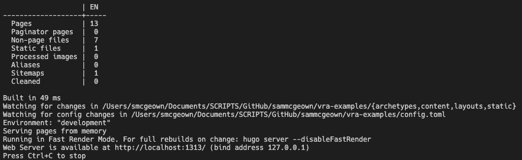

# How to contribute

The vRealize Automation Examples team welcomes contributions from the community!

## Contributing Workflow

1. Fork the repository
2. Clone the fork and submodules
* e.g. `git clone --recurse-submodules https://github.com/<your username>/vra-examples.git`
* or `git clone https://github.com/<your username>/vra-examples.git`, `git submodule init`, `git submodule update`
3. Create a branch for the new example - e.g. `git branch -b my-new-example
4. Add the example
5. Check in the example `git add path/to/example.md`
6. Write a descriptive commit message `git commit -m "New example workflow that does this"`
7. Push the new branch `git push -u origin my-new-example`
8. Create a pull request
    

Once the PR is approved, the changes will be published.

# Content structure
The `vra-examples/content` folder structure represents the page structure on the site:


To add a new parent topic:
1. Create the parent folder - e.g. `SaltStack Config`
2. Create the `_index.md`
    ```yaml
    ---
    title: "SaltStack Config"
    date: 2020/11/04 14:21
    anchor: "saltstackconfig"
    weight: 400
    ---
    SaltStack Config Examples - a short description or introduction to the section.
    ```
3. Create subfolder to create a content type - e.g. `Salt States`
4. Create the `_index.md` content section header
    ```yaml
    ---
    title: "Salt States"
    date: 2020/11/04 14:21
    anchor: "saltstates"
    weight: 410
    ---
    Salt States
    ```
5. Create a content file - e.g. `Apache Install Salt State.md`
    ```yaml
    ---
    title: "Apache Install Salt State"
    date: 2020/11/04 14:21
    anchor: "apacheinstallsaltstate"
    ---
    This Salt State can be used to install Apache and ensure that the service is running:

        ```yaml
        apache:
        pkg.installed: []
        service.running:
            - require:
            - pkg: apache
        ```
    ```

## Testing modifications locally

Install Hugo on your local machine - https://gohugo.io/getting-started/installing/

I'm using a Mac - 
```bash
brew install hugo
```
Move into the `vra-examples` folder and run:

```shell
hugo server
```

Hugo will generate the static files and create a temporary web server locally

